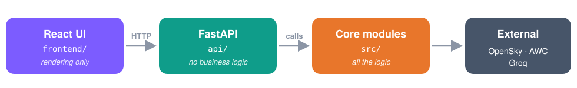
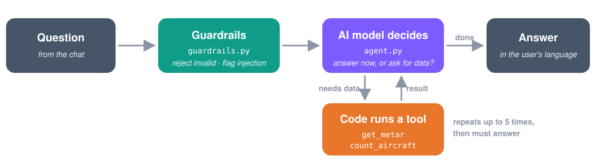

# ✈️ airspace-copilot

An AI copilot that explains live air traffic and aviation weather in plain English or Portuguese.

## What it does

🌍 **Live traffic**: aircraft on a 3D globe, per continent or the whole world

📝 **Briefing**: a short AI summary of the current airspace

🌦️ **Weather decoding**: `SBGR 091800Z 19011G21KT 6000…` explained in plain words

💬 **Copilot chat**: *"Is the weather good for landing in Guarulhos?"*

📊 **Evaluation**: the weather decoder scored against hand-checked answers

## Quick start

**What you need**

🐍 **Python 3.11+** and 🟩 **Node.js 20+**

🔑 **Groq API key** (runs the AI): [console.groq.com](https://console.groq.com)

🛰️ **OpenSky client ID and secret** (flight data): [opensky-network.org](https://opensky-network.org) → Account → API Client

**Steps**

**① Create a Python environment**: `python -m venv .venv`

**② Activate it**: `.venv\Scripts\Activate.ps1` (macOS/Linux: `source .venv/bin/activate`)

**③ Install packages**: `pip install -r requirements.txt`

**④ Add your keys**: create `.env` in the project root with `GROQ_API_KEY`, `OPENSKY_CLIENT_ID` and `OPENSKY_CLIENT_SECRET`

**⑤ Point the UI to your API**: create `frontend/.env.local` containing `VITE_API_BASE_URL=http://localhost:8000`

**⑥ Terminal 1, start the API**: `uvicorn api.main:app --reload --port 8000`

**⑦ Terminal 2, start the UI**: `cd frontend`, then `npm install`, then `npm run dev`

**⑧ Open** http://localhost:8080 🎉

## Optional settings

Add any of these to `.env`:

🤖 `LLM_MODEL`: Groq model, default `openai/gpt-oss-120b`

🌐 `CORS_ORIGINS`: sites allowed to call the API, default `http://localhost:8080`

💬 `ASK_RATE_LIMIT_PER_MINUTE`: chat questions per user per minute, default `10`

🌦️ `WEATHER_RATE_LIMIT_PER_MINUTE`: weather lookups per user per minute, default `20`

🧵 `WORKER_THREADS`: API worker threads, default `100`

🏢 `USE_SYSTEM_TRUSTSTORE`: set to `1` on corporate networks with certificate errors

## Troubleshooting

😶 **Page loads but shows no data**: check that terminal 1 (the API) is still running

🔀 **Page shows data, but not from your API**: check that `frontend/.env.local` exists (step ⑤)

🔒 **Certificate / SSL errors**: add `USE_SYSTEM_TRUSTSTORE=1` to `.env` and restart the API

⏳ **`429 llm_rate_limited`**: the Groq quota ran out, so wait a minute

## Project map

🧠 **`src/`**: all the logic: data clients, AI calls, RAG, agent, guardrails

🔌 **`api/`**: FastAPI endpoints. See [api/README.md](api/README.md)

🖥️ **`frontend/`**: React web app. See [frontend/README.md](frontend/README.md)

📊 **`evals/`**: weather decoder evaluation

📚 **`knowledge/`**: weather reference docs the AI reads

🧪 **`tests/`**: backend tests (no network, no tokens)

## How the copilot answers

🔒 **Only 2 read-only tools**: the AI can't do anything beyond reading data

🔁 **Max 5 rounds**: no endless loops

♻️ **Repeated call forces an answer**: the AI never fetches the same data twice

🛡️ **Guardrails flag manipulation**: suspicious questions are logged and answered safely

## Saving AI tokens

📉 **Briefings send counts, not every aircraft**: about 200 tokens, even for the whole world

♻️ **Briefings are reused** until traffic changes by about 10%

🌦️ **Each weather report is decoded once**

⏱️ **Flight data is cached for 30 s**, so all users share one OpenSky call

Every AI call logs its cost, e.g. `[llm] briefing: prompt=412 completion=180`.

## Evaluation

The weather decoder is compared field by field with answers checked by hand against the ICAO/FAA spec. Latest run (5 cases × 3):

✅ **97.3%** of fields correct

🎯 **66.7%** perfect runs

⚠️ **Open issues**: sometimes explains codes missing from the docs (`VCTS`), and sometimes refuses documented ones (`FEW025`)

Run it with `python evals/evaluate.py --repeat 3`. It spends Groq tokens.

## Known limitations

🌊 **Few aircraft over oceans**: OpenSky relies on volunteer ground receivers

🤖 **The AI can still make mistakes**: RAG reduces errors but doesn't remove them

🛡️ **Guardrails only apply through the API**: the terminal demo calls the agent directly

## Commands

🖥️ `python -m src.main`: terminal demo of every feature

🧪 `pip install pytest && pytest`: backend tests

📊 `python evals/evaluate.py --repeat 3`: decoder evaluation (spends tokens)

📚 `python -m src.rag`: rebuild the knowledge index after editing `knowledge/`
