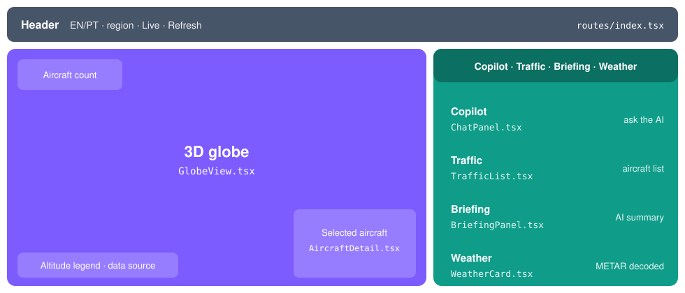

# 🖥️ Frontend

React + TypeScript web app. It only shows what the API returns; there is no logic and no secrets here.

## Run it

Start the API first ([root README](../README.md#quick-start)), then, inside `frontend/`:

**① Point to your local API**: create `.env.local` containing `VITE_API_BASE_URL=http://localhost:8000`

**② Install packages** (first time only): `npm install`

**③ Start**: `npm run dev`, then open http://localhost:8080

**Other commands**

`npm run dev`: dev server, reloads on save

`npm run build`: production build

`npm run lint`: code style check

`npm run typecheck`: checks TypeScript types without building

`npm run format`: auto-formats the code

## Where to find things

📐 **Page layout**: `src/routes/index.tsx`

🧩 **A panel** (chat, list, briefing, weather): `src/components/`

🔌 **Calls to the backend**: `src/lib/api.ts`

⚙️ **Regions, default airports, API address**: `src/config.ts`

🌐 **Texts and translations**: `src/lib/i18n-strings.ts`

⛔ **Don't edit** `src/routeTree.gen.ts`. It is generated automatically.

## Globe markers

🟨 **Yellow**: low, below ~3,000 m

🟧 **Orange**: medium, 3,000–9,000 m

🟪 **Violet**: cruising, above ~9,000 m

⬜ **Grey**: on the ground

Above 1,500 aircraft the globe draws a spread-out sample, while the counter always shows the real total.

## Data refresh

✈️ **Aircraft**: every 60 s while **Live** is on, because positions change constantly

📝 **Briefing**: every 5 min, because it uses AI and traffic changes slowly

🌦️ **Weather**: every 15 min, because it uses AI and new reports are rare

🚫 **4xx errors**: never retried, because retrying won't fix them

⚠️ **OpenSky down**: the last positions stay on the map with a **Stale** badge
